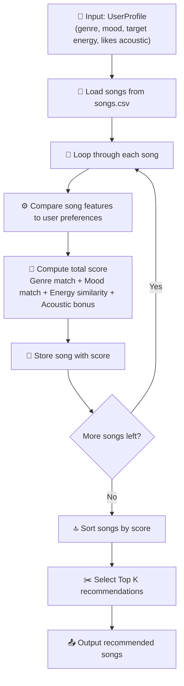
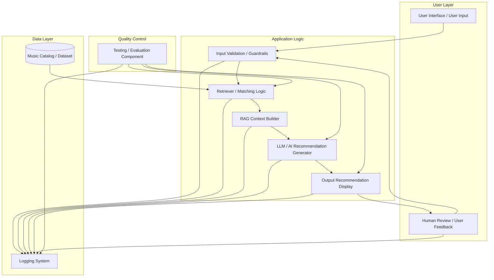

# 🎵 Applied AI Music Recommender

## Project Summary

**Applied AI Music Recommender** is an AI-enhanced music recommendation system that helps users find songs based on their preferences, mood, energy level, and listening context.

This project extends my original rule-based music recommender into a **Retrieval-Augmented Generation (RAG)** system. Instead of asking an AI model to recommend songs from memory, the system first retrieves relevant songs from a local music catalog and then uses an AI model to generate personalized recommendations and natural-language explanations based on those retrieved songs.

This project matters because real-world recommendation systems need to balance structured data, user preferences, explainability, and reliability. By combining deterministic retrieval with AI-generated explanations, this project shows how a simple recommender can evolve into a more flexible and user-centered applied AI system.

---

## Original Project From Modules 1–3

This final project is based on my original Modules 1–3 project: **Music Recommender Simulation**.

The original project was a rule-based recommender that loaded songs from a local `songs.csv` dataset and compared each song against a user taste profile. It used features such as genre, mood, energy, tempo, and acoustic qualities to compute a recommendation score, then returned the top-ranked songs with simple explanation reasons.

The goal of the original project was to show how recommendation systems can turn structured data into ranked predictions and how bias or limitations can appear in rule-based AI systems.

---

## How the Original System Worked

The original recommendation system compared each song in the dataset to the user’s music preferences.

Each `Song` used features such as:

- Genre
- Mood
- Energy
- Tempo
- Acoustic-related information

The `UserProfile` stored preferences such as:

- Favorite genre
- Favorite mood
- Target energy level
- Acoustic preference

The `Recommender` computed a score for each song using simple rules:

- **Genre match:** +2.0 points
- **Mood match:** +1.0 point
- **Energy similarity:** higher score when the song’s energy is closer to the user’s target energy
- **Acoustic bonus:** small bonus when the user prefers acoustic songs and the song matches that preference

After scoring every song, the system sorted songs from highest to lowest score and recommended the top results.

### Original Rule-Based Recommendation Flow



---

## New AI Feature: RAG-Based Recommendation

For the final project, I am evolving the original rule-based system into a **RAG-based AI music recommender**.

RAG stands for **Retrieval-Augmented Generation**. In this project, that means the system does not ask the AI model to recommend songs without context. Instead, it first retrieves relevant songs from the local music catalog, then provides those retrieved songs as context to the AI model. The AI model then generates personalized explanations based on the retrieved candidates.

The new workflow is:

1. The user enters a music preference, mood, activity, or listening goal.
2. The system validates the input using guardrails.
3. The retriever searches the local song catalog and ranks candidate songs.
4. The RAG context builder formats the retrieved songs into a structured prompt.
5. The LLM generates personalized recommendations and explanations.
6. The app displays the final recommendations to the user.
7. Logging and testing components track system behavior and check reliability.

This makes the system more flexible than the original version because it can explain recommendations in a more natural and personalized way while still staying grounded in the available song dataset.

---

## Architecture Overview

The system is organized into several main components:

- **User Interface / User Input:** Collects the user’s music preference or listening context.
- **Input Validation / Guardrails:** Checks that the input is valid, music-related, and safe to process.
- **Music Catalog / Dataset:** Stores the local song data used by the recommender.
- **Retriever / Matching Logic:** Uses the original scoring logic to find the most relevant songs.
- **RAG Context Builder:** Converts retrieved songs and user preferences into structured context for the AI model.
- **LLM / AI Recommendation Generator:** Generates personalized recommendation explanations.
- **Output Recommendation Display:** Shows the final ranked recommendations to the user.
- **Logging System:** Records user input, retrieval results, AI responses, and errors.
- **Testing / Evaluation Component:** Checks that retrieval, generation, and guardrails work correctly.
- **Human Review / User Feedback:** Allows users or reviewers to evaluate whether the recommendations make sense.

### System Diagram



The main data flow is:

```text
User input
→ Input validation / guardrails
→ Song retrieval from local catalog
→ RAG context building
→ AI-generated recommendation explanation
→ Output display
→ Human review or testing feedback
```

---

## Design Decisions

### Why use RAG?

I chose a RAG-based design because it improves the original recommender without removing the explainability of the rule-based system. The original scoring logic is useful because it gives predictable and testable retrieval results. The AI model adds value by turning those retrieved results into more helpful, natural-language recommendations.

### Why keep the local song catalog?

Using a local catalog makes the system easier to test and reproduce. It also reduces the chance that the AI model recommends songs outside the available dataset. This keeps the system grounded and makes the project more reliable for a course demo or portfolio review.

### Why keep rule-based scoring?

The rule-based scoring system is simple, but it is transparent. It allows me to explain why songs were retrieved before the AI model generates its final response. This is a useful trade-off: the system may be less flexible than a large production recommender, but it is easier to debug, test, and explain.

### Trade-offs

This design has several trade-offs:

- The system is more explainable, but it depends heavily on the quality and size of the song catalog.
- The AI-generated explanations are more natural, but they require guardrails and testing.
- The local dataset makes the project reproducible, but it limits recommendation variety.
- The rule-based retriever is easy to understand, but it may miss songs that match the user’s intent in a more subtle way.
- The system can generate better explanations, but those explanations still need to stay grounded in the retrieved data.

---

## Sample Interactions

> Note: These examples show the intended final behavior of the RAG-based system. The final output may vary depending on the model, dataset, and implementation.

### Example 1: Calm Study Music

**User input:**

```text
I want calm acoustic music for studying.
```

**AI output:**

```text
Based on your preference for calm acoustic study music, I recommend:

1. "Quiet Morning"
   This song is a strong match because it has a calm mood, lower energy, and acoustic qualities that make it suitable for focused work.

2. "Soft Window Light"
   This track fits your study context because it is gentle and not overly energetic, which helps reduce distraction.

3. "Evening Pages"
   This recommendation works well because its relaxed mood and acoustic texture support a quiet listening environment.

These songs were selected from the local catalog because they best matched your requested mood, energy level, and acoustic preference.
```

---

### Example 2: High-Energy Pop

**User input:**

```text
Recommend upbeat pop songs for a workout.
```

**AI output:**

```text
Here are some high-energy pop recommendations for your workout:

1. "Neon Run"
   This song matches your request because it has a pop genre label and a high energy score, making it a good fit for movement and motivation.

2. "City Lights"
   This track has an upbeat mood and strong tempo, which makes it suitable for an active listening context.

3. "Pulse Beat"
   This recommendation fits because it combines high energy with a bright pop style.

The system retrieved these songs from the catalog before generating the explanation, so the recommendations are grounded in available song data.
```

---

### Example 3: Conflicting Preferences

**User input:**

```text
I want intense rock music, but I also prefer acoustic songs.
```

**AI output:**

```text
Your request combines two preferences that may conflict: intense rock usually has high energy, while acoustic songs are often softer or less aggressive. Based on the available catalog, I recommend:

1. "Raw Strings"
   This song is the closest match because it includes acoustic qualities while still having a stronger, more intense mood.

2. "Storm Echo"
   This track fits the rock and intensity preference, although it may be less acoustic than your ideal choice.

3. "Dark Avenue"
   This song matches the high-energy rock side of your request, but it may not fully satisfy the acoustic preference.

Because the catalog has limited songs, the system prioritized the closest overall matches rather than requiring every preference to match perfectly.
```

---

## CLI Verification

The original rule-based version was tested through the command line. The terminal output showed the top recommendations, their scores, and the reasons generated by the scoring function.


---

## Stress Test Results From Original Version

I tested the original recommender with multiple user profiles to see whether the scoring logic produced sensible recommendations across different music preferences. For each profile, I ran the program in the terminal and reviewed the top 5 recommended songs, along with their scores and explanation reasons.

### High-Energy Pop

This profile preferred upbeat pop songs with high energy and no acoustic preference.


### Chill Lofi

This profile preferred chill lofi songs with low energy and an acoustic preference.


### Deep Intense Rock

This profile preferred intense rock songs with very high energy and no acoustic preference.


### Acoustic Metal

This edge-case profile combined intense rock preferences with a strong acoustic preference. I used it to test whether the system could handle conflicting preferences without producing unreasonable recommendations.


---

## Testing Summary

The project includes automated tests for the original recommender logic using `pytest`.

Current tests check that:

- Songs can be loaded from the dataset.
- The recommender returns ranked results.
- Higher-scoring songs appear before lower-scoring songs.
- Explanation reasons are generated.
- The system can handle different user profiles.

For the final RAG-based version, I plan to add or expand tests for:

- Input validation and guardrails.
- Retriever behavior.
- RAG context formatting.
- AI output fallback behavior.
- Whether AI recommendations stay grounded in retrieved songs.
- Whether invalid or unrelated input is handled safely.

### What worked

The original scoring system worked well for simple profiles where genre, mood, and energy were clearly aligned. It also produced understandable explanations because the scoring logic was transparent.

### What did not work as well

The system was limited by the small song catalog and exact label matching. If a user wanted a mood or genre that was not represented in the dataset, the recommender could only return the closest available match. The original version also could not explain recommendations in a very natural or personalized way.

### What I learned from testing

Testing showed that even a simple recommender can behave differently across user profiles. It also showed that recommendation quality depends heavily on the dataset, feature design, and scoring weights. The RAG-based upgrade is meant to address some of these issues by keeping retrieval grounded while improving the quality of explanations.

---

## Limitations and Risks

This recommender still has several limitations:

- It only works on a small local song catalog.
- It does not truly understand audio, lyrics, or user listening history.
- It may over-prioritize exact genre and mood labels.
- It may recommend the same songs repeatedly if the dataset is too small.
- AI-generated explanations may sound confident even when the match is weak.
- The system needs guardrails to avoid unrelated or inappropriate user requests.
- The system should avoid pretending that it knows songs or metadata outside the local dataset.

Because of these risks, the final system uses retrieval grounding, logging, and testing to make the AI behavior more reliable and easier to inspect.

---

## Getting Started

### Prerequisites

Make sure you have Python installed.

This project was developed using Python 3.

### Setup

1. Clone the repository:

```bash
git clone https://github.com/hsuanlee213/applied-ai-music-recommender.git
cd applied-ai-music-recommender
```

2. Create a virtual environment:

```bash
python -m venv .venv
```

3. Activate the virtual environment:

Mac or Linux:

```bash
source .venv/bin/activate
```

Windows:

```bash
.venv\Scripts\activate
```

4. Install dependencies:

```bash
pip install -r requirements.txt
```

5. If using an AI API, create a `.env` file:

```text
OPENAI_API_KEY=your_api_key_here
```

If the final version uses a local or mock AI response instead of an API key, this step may not be required.

6. Run the app:

```bash
python -m src.main
```

---

## Running Tests

Run all tests with:

```bash
pytest
```

You can add more tests in:

```text
tests/test_recommender.py
```

Future tests for the RAG-based system may be added to files such as:

```text
tests/test_retriever.py
tests/test_guardrails.py
tests/test_rag_context.py
tests/test_ai_generator.py
```

---

## Project Structure

```text
applied-ai-music-recommender/
  assets/
    system-architecture.png

  data/
    songs.csv

  images/
    cli-output.png
    high-energy-pop.png
    chill-lofi.png
    deep-intense-rock.png
    acoustic-metal.png

  src/
    main.py
    recommender.py
    rag.py
    llm_client.py
    guardrails.py
    logger_config.py

  tests/
    test_recommender.py

  README.md
  requirements.txt
  model_card.md
  .env.example
  .gitignore
```

Some of these files may be added as the final project evolves. The goal of this structure is to keep source code, data, tests, screenshots, and architecture assets organized.

---

## Reflection

This project taught me that recommendation systems are not only about ranking items. They also depend on how data is represented, how user preferences are interpreted, and how clearly the system can explain its decisions. In the original rule-based version, I saw how simple scoring rules could create understandable recommendations, but I also saw how easily those rules could become biased toward certain genres, moods, or labels.

The RAG-based version helped me think about applied AI as a system design problem rather than just a model problem. The AI model is only one part of the pipeline. Retrieval, guardrails, logging, testing, and human review all matter because they make the system more reliable and easier to trust. This project showed me that building useful AI requires both technical implementation and careful thinking about limitations, failure cases, and user needs.

---

## Model Card

For a deeper reflection on system behavior, limitations, and risks, see:

[**Model Card**](model_card.md)
# 🎧 Model Card - Music Recommender Simulation

## 1. Model Name

Give your recommender a name, for example:

> VibeFinder 1.0

---

## 2. Intended Use

- What is this system trying to do
- Who is it for

Example:

> This model suggests 3 to 5 songs from a small catalog based on a user's preferred genre, mood, and energy level. It is for classroom exploration only, not for real users.

---

## 3. How It Works (Short Explanation)

Describe your scoring logic in plain language.

- What features of each song does it consider
- What information about the user does it use
- How does it turn those into a number

Try to avoid code in this section, treat it like an explanation to a non programmer.

---

## 4. Data

Describe your dataset.

- How many songs are in `data/songs.csv`
- Did you add or remove any songs
- What kinds of genres or moods are represented
- Whose taste does this data mostly reflect

---

## 5. Strengths

Where does your recommender work well

You can think about:
- Situations where the top results "felt right"
- Particular user profiles it served well
- Simplicity or transparency benefits

---

## 6. Limitations and Bias

Where does your recommender struggle

Some prompts:
- Does it ignore some genres or moods
- Does it treat all users as if they have the same taste shape
- Is it biased toward high energy or one genre by default
- How could this be unfair if used in a real product

---

## 7. Evaluation

How did you check your system

Examples:
- You tried multiple user profiles and wrote down whether the results matched your expectations
- You compared your simulation to what a real app like Spotify or YouTube tends to recommend
- You wrote tests for your scoring logic

You do not need a numeric metric, but if you used one, explain what it measures.

---

## 8. Future Work

If you had more time, how would you improve this recommender

Examples:

- Add support for multiple users and "group vibe" recommendations
- Balance diversity of songs instead of always picking the closest match
- Use more features, like tempo ranges or lyric themes

---

## 9. Personal Reflection

A few sentences about what you learned:

- What surprised you about how your system behaved
- How did building this change how you think about real music recommenders
- Where do you think human judgment still matters, even if the model seems "smart"

