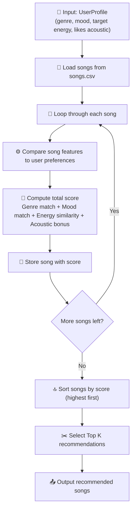

# 🎵 Music Recommender Simulation

## Project Summary

In this project you will build and explain a small music recommender system.

Your goal is to:

- Represent songs and a user "taste profile" as data
- Design a scoring rule that turns that data into recommendations
- Evaluate what your system gets right and wrong
- Reflect on how this mirrors real world AI recommenders

Replace this paragraph with your own summary of what your version does.

---

## How The System Works

Explain your design in plain language.

Some prompts to answer:

- What features does each `Song` use in your system
  - For example: genre, mood, energy, tempo
- What information does your `UserProfile` store
- How does your `Recommender` compute a score for each song
- How do you choose which songs to recommend

You can include a simple diagram or bullet list if helpful.

Answer:
This recommendation system works by comparing each song in the dataset to the user’s music preferences. Each `Song` includes features such as **genre, mood, energy**, and whether it has stronger **acoustic qualities**. The `UserProfile` stores the kind of music the user likes, including a favorite genre, favorite mood, target energy level, and whether the user prefers acoustic songs. The `Recommender` checks how similar each song is to the user profile. It gives points for a matching genre and mood, gives more points when a song’s energy is closer to the user’s target energy, and can give a small bonus when the user prefers acoustic songs and the song fits that preference. After scoring every song, the system sorts them from highest to lowest score and recommends the top songs to the user.

Simple bullet list

- `Song` stores features like genre, mood, energy, and acoustic-related information
- `UserProfile` stores the user’s favorite genre, favorite mood, target energy, and acoustic preference
- `Recommender` compares each song to the user profile
- Matching genre and mood add points
- Songs get a higher energy score when their energy is closer to the user’s target
- Songs may receive an acoustic bonus if they match the user’s preference
- All feature scores are combined into one final score
- Songs are ranked by score, and the top songs are recommended

### Algorithm Recipe

For each song, the recommender computes a score using these rules:

- **Genre match:** +2.0 points
- **Mood match:** +1.0 point
- **Energy similarity:** songs closer to

### Simple diagram



### Potential Biases

This system may over-prioritize genre and exact mood labels, which means it could miss songs that match the user’s overall vibe but use a different label. It is also limited by the small dataset and by the fact that the scoring logic uses only a few features, so some good recommendations may be overlooked.

---
## CLI Verification

Here is a sample terminal output showing the top recommendations, their scores, and the reasons generated by the scoring function.


---
## Stress Test Results

I tested the recommender with multiple user profiles to see whether the scoring logic produced sensible recommendations across different music preferences. For each profile, I ran the program in the terminal and reviewed the top 5 recommended songs, along with their scores and explanation reasons.

### High-Energy Pop

This profile prefers upbeat pop songs with high energy and no acoustic preference.


### Chill Lofi

This profile prefers chill lofi songs with low energy and an acoustic preference.


### Deep Intense Rock

This profile prefers intense rock songs with very high energy and no acoustic preference.


### Acoustic Metal

This edge-case profile combines intense rock preferences with a strong acoustic preference. I used it to test whether the system could handle conflicting preferences without producing unreasonable recommendations.


---

## Getting Started

### Setup

1. Create a virtual environment (optional but recommended):

   ```bash
   python -m venv .venv
   source .venv/bin/activate      # Mac or Linux
   .venv\Scripts\activate         # Windows

2. Install dependencies

```bash
pip install -r requirements.txt
```

3. Run the app:

```bash
python -m src.main
```

### Running Tests

Run the starter tests with:

```bash
pytest
```

You can add more tests in `tests/test_recommender.py`.

---

## Experiments You Tried

Use this section to document the experiments you ran. For example:

- What happened when you changed the weight on genre from 2.0 to 0.5
- What happened when you added tempo or valence to the score
- How did your system behave for different types of users

I tested the recommender with several user profiles, including High-Energy Pop, Chill Lofi, Deep Intense Rock, and Acoustic Metal. I also ran a small experiment where I temporarily removed the mood check from the scoring logic. After that change, the system still worked, but the recommendations became more dependent on genre and energy similarity. The results changed most for profiles like Chill Lofi, which showed that mood is important for capturing musical vibe.

---

## Limitations and Risks

Summarize some limitations of your recommender.

Examples:

- It only works on a tiny catalog
- It does not understand lyrics or language
- It might over favor one genre or mood

You will go deeper on this in your model card.

This recommender only works on a small song catalog, so the same songs can appear repeatedly across different users. It relies on simple features like genre, mood, and energy, and does not understand lyrics, language, or deeper musical meaning. It may also over-favor genres that have more examples in the dataset, while users with rare or underrepresented tastes get less variety. Because it uses exact labels, similar moods or genres may be treated as totally different.

---

## Reflection

Read and complete `model_card.md`:

[**Model Card**](model_card.md)

Write 1 to 2 paragraphs here about what you learned:

- about how recommenders turn data into predictions
- about where bias or unfairness could show up in systems like this


---

## 7. `model_card_template.md`

Combines reflection and model card framing from the Module 3 guidance. :contentReference[oaicite:2]{index=2}  

```markdown
# 🎧 Model Card - Music Recommender Simulation

## 1. Model Name

Give your recommender a name, for example:

> VibeFinder 1.0

---

## 2. Intended Use

- What is this system trying to do
- Who is it for

Example:

> This model suggests 3 to 5 songs from a small catalog based on a user's preferred genre, mood, and energy level. It is for classroom exploration only, not for real users.

---

## 3. How It Works (Short Explanation)

Describe your scoring logic in plain language.

- What features of each song does it consider
- What information about the user does it use
- How does it turn those into a number

Try to avoid code in this section, treat it like an explanation to a non programmer.

---

## 4. Data

Describe your dataset.

- How many songs are in `data/songs.csv`
- Did you add or remove any songs
- What kinds of genres or moods are represented
- Whose taste does this data mostly reflect

---

## 5. Strengths

Where does your recommender work well

You can think about:
- Situations where the top results "felt right"
- Particular user profiles it served well
- Simplicity or transparency benefits

---

## 6. Limitations and Bias

Where does your recommender struggle

Some prompts:
- Does it ignore some genres or moods
- Does it treat all users as if they have the same taste shape
- Is it biased toward high energy or one genre by default
- How could this be unfair if used in a real product

---

## 7. Evaluation

How did you check your system

Examples:
- You tried multiple user profiles and wrote down whether the results matched your expectations
- You compared your simulation to what a real app like Spotify or YouTube tends to recommend
- You wrote tests for your scoring logic

You do not need a numeric metric, but if you used one, explain what it measures.

---

## 8. Future Work

If you had more time, how would you improve this recommender

Examples:

- Add support for multiple users and "group vibe" recommendations
- Balance diversity of songs instead of always picking the closest match
- Use more features, like tempo ranges or lyric themes

---

## 9. Personal Reflection

A few sentences about what you learned:

- What surprised you about how your system behaved
- How did building this change how you think about real music recommenders
- Where do you think human judgment still matters, even if the model seems "smart"

